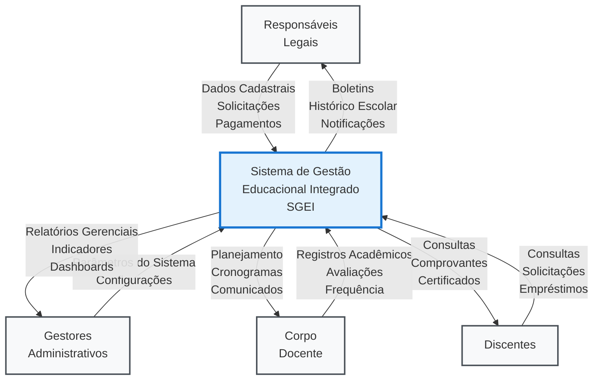
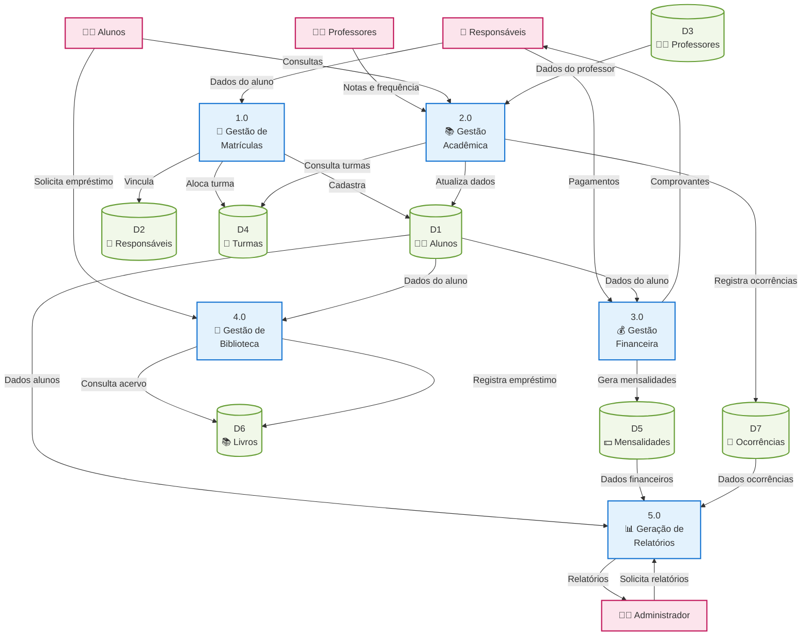
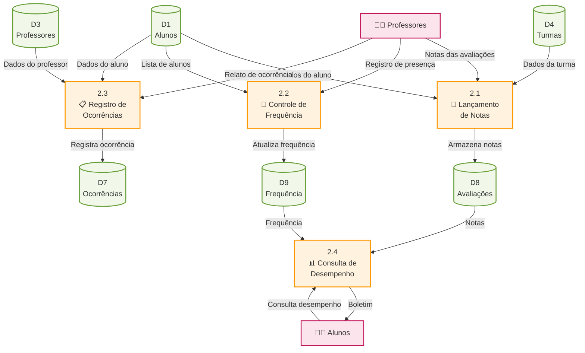

# 📊 Diagramas de Fluxo de Dados (DFD) - Sistema de Gerenciamento Escolar

## 🎯 DFD Nível 0 - Diagrama de Contexto

---

## 🔍 DFD Nível 1 - Processos Detalhados

---

## 🔬 DFD Nível 2 - Detalhamento do Processo 2.0 (Gestão Acadêmica)

---

## 📋 Especificações Técnicas dos Fluxos

### **DFD Nível 0:**
- **F1**: Dados cadastrais, solicitações de matrícula, pagamentos
- **F2**: Registros acadêmicos, avaliações, controle de frequência
- **F3**: Consultas acadêmicas, solicitações de biblioteca
- **F4**: Parâmetros do sistema, configurações administrativas
- **F5**: Relatórios gerenciais, indicadores de performance
- **F6**: Boletins, histórico escolar, notificações
- **F7**: Planejamento acadêmico, cronogramas, comunicados
- **F8**: Consultas aprovadas, comprovantes, certificados

### **DFD Nível 1:**
- **Processo 1.0**: Gerencia todo o ciclo de vida das matrículas
- **Processo 2.0**: Controla atividades acadêmicas e pedagógicas
- **Processo 3.0**: Administra mensalidades e pagamentos
- **Processo 4.0**: Gerencia empréstimos e acervo bibliográfico
- **Processo 5.0**: Gera relatórios e indicadores de gestão

### **Depósitos de Dados:**
- **D1-D7**: Armazenam dados persistentes do sistema
- **Integridade**: Relacionamentos com chaves estrangeiras
- **Backup**: Rotinas automatizadas de backup
- **Segurança**: Controle de acesso por perfil de usuário
