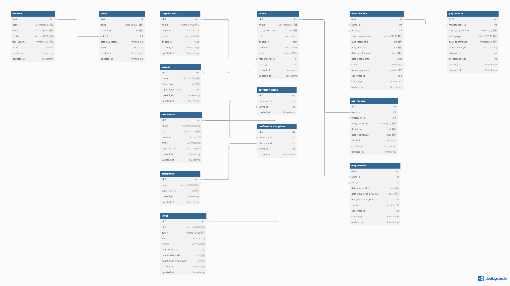

# Sistema de Gerenciamento Escolar Infantil

Um sistema completo para gestão de alunos, turmas, professores, responsáveis, mensalidades, biblioteca e eventos de uma escola infantil.

---

> ## Diagrama de Arquitetura do Sistema
>
> O diagrama abaixo ilustra a arquitetura geral do Sistema de Gerenciamento Escolar Infantil, detalhando a interação entre os principais componentes da solução:
>
> **Frontend:** Desenvolvido em React + Vite, responsável pela interface com o usuário.
>
> **Nginx:** Atua como proxy reverso, direcionando as requisições do frontend para o backend.
>
> **Backend:** Implementado em Node.js/Express, responsável pelas regras de negócio e comunicação com o banco de dados.
>
> **Banco de Dados:** Utiliza PostgreSQL para armazenamento persistente das informações.
>
> **Infraestrutura:** Orquestrada via Docker e Docker Compose, garantindo portabilidade e facilidade de implantação.
>
> A imagem a seguir representa visualmente essa arquitetura:
>
> 

---

> ## Diagrama Entidade-Relacionamento (DER)
>
> O DER abaixo mostra a estrutura do banco de dados do sistema, com todas as tabelas e relacionamentos:
>
> 
>
> **📋 Documentação completa do banco:** [Docs/README.md](./Docs/README.md)

---

## Descrição

Este projeto visa facilitar o controle acadêmico, financeiro e administrativo de escolas infantis, centralizando informações de alunos, professores, turmas, responsáveis, mensalidades, biblioteca, eventos e mais. O sistema é composto por backend (Node.js/Express), frontend (React + TypeScript + Vite), banco de dados PostgreSQL e infraestrutura Docker.

---

## Tecnologias Utilizadas

- **Backend:** Node.js, Express, PostgreSQL, node-pg-migrate
- **Frontend:** React, TypeScript, Vite, Sass
- **Banco de Dados:** PostgreSQL
- **Infraestrutura:** Docker, Docker Compose, Nginx
- **Scripts:** PowerShell (`start-tudo.ps1`)

---

## Arquivos de variáveis de ambiente

Após clonar o projeto, copie os arquivos de exemplo de variáveis de ambiente e renomeie para `.env` conforme necessário:

- Para o frontend:
  - Copie `frontend/.env.example` para `frontend/.env`
- Para o backend (opcional, se usar dotenv):
  - Copie `APP/.env.example` para `APP/.env`

Edite os valores conforme sua necessidade. Esses arquivos não são enviados para o repositório por segurança.

---

## Como Instalar/Configurar

### Pré-requisitos
- Docker e Docker Compose ([Download Docker Desktop](https://www.docker.com/products/docker-desktop/))
- Windows PowerShell (recomendado)
- Node.js (apenas se for rodar o frontend fora do Docker)

### Instalação Rápida (Recomendado)

Abra o PowerShell na raiz do projeto e execute:

```powershell
./start-tudo.ps1
```

Esse script irá:
- Derrubar containers antigos e volumes
- Subir backend, banco de dados e nginx
- Rodar as migrations e seeds automaticamente
- Subir o frontend (Vite) em uma nova janela

Acesse o frontend em: [http://localhost:5173](http://localhost:5173)
Acesse a API backend em: [http://localhost:3000](http://localhost:3000)

### Instalação Manual (Opcional)

```powershell
# (1) Construa as imagens Docker
./docker-compose build

# (2) Suba os containers
./docker-compose up -d --build

# (3) Rode as migrations
./docker-compose exec backend node run-migrations.js

# (4) Rode os seeds
./docker-compose exec backend node run-seeds.js

# (5) Suba o frontend
cd frontend
npm install
npm run dev
```

---

## Como Usar

- Acesse o frontend em [http://localhost:5173](http://localhost:5173) para utilizar o sistema via interface web.
- Acesse a API REST em [http://localhost:3000](http://localhost:3000) para integração ou testes com ferramentas como Postman.
- Exemplos de endpoints:
  - [http://localhost:3000/alunos](http://localhost:3000/alunos)
  - [http://localhost:3000/professores](http://localhost:3000/professores)
  - [http://localhost:3000/turmas](http://localhost:3000/turmas)
  - [http://localhost:3000/disciplinas](http://localhost:3000/disciplinas)
  - [http://localhost:3000/mensalidades](http://localhost:3000/mensalidades)

---

## Divisão de Commits e Responsabilidades

| Responsável      | Pasta/Arquivo                | Descrição/Tarefas principais                         |
|------------------|-----------------------------|------------------------------------------------------|
| Ryan e Kaua      | APP/                        | Backend: APIs, migrations, seeds, config do banco    |
| Ryan             | Dockerfile, Dockerfile.db   | Docker backend e banco                               |
| Ryan             | docker-compose.yml          | Configuração dos serviços Docker                     |
| Ryan             | nginx.conf                  | Configuração do Nginx                                |
| Ryan             | start-tudo.ps1              | Script de automação do ambiente                      |
| Kaua             | frontend/                   | Frontend: Telas, componentes, integração com backend |
| Kaua             | frontend/package.json       | Dependências e scripts do frontend                   |
| Kaua             | frontend/.env.example       | Variáveis de ambiente do frontend                    |
| Ambos            | README.md                   | Documentação geral do projeto                        |


---

## Licença

Distribuído sob a licença MIT. Veja o arquivo LICENSE para mais detalhes.

---

## Observações
- O banco de dados é criado via migrations, não pelo banco.sql diretamente.
- Os dados iniciais são inseridos automaticamente via seeds.
- O frontend consome a API do backend para exibir e cadastrar dados.

---

## O que foi feito para o projeto funcionar

1. **Instalou as dependências do backend**
   - Entrou na pasta `APP` e rodou:
     ```powershell
     cd APP
     npm install
     npm install node-pg-migrate
     ```
   - Isso garantiu que todas as bibliotecas do backend, incluindo o `node-pg-migrate`, estivessem instaladas.

2. **Construiu as imagens Docker**
   - Na raiz do projeto, rodou:
     ```powershell
     docker-compose build
     ```
   - Isso preparou os containers do banco, backend e nginx.

3. **Subiu os containers**
   - Ainda na raiz, rodou:
     ```powershell
     docker-compose up -d --build
     ```
   - Isso iniciou o banco de dados, backend e nginx.

4. **Rodou as migrations**
   - Para criar as tabelas no banco, rodou:
     ```powershell
     docker-compose exec backend sh -c "cd APP && node run-migrations.js"
     ```
   - Agora o banco tem todas as tabelas necessárias.

5. **Rodou os seeds**
   - Para inserir dados iniciais no banco, rodou:
     ```powershell
     docker-compose exec backend sh -c "cd APP && node run-seeds.js"
     ```

6. **Subiu o frontend**
   - Foi até a pasta `frontend`, instalou as dependências e rodou o servidor:
     ```powershell
     cd frontend
     npm install
     npm run dev
     ```
   - O site ficou disponível em [http://localhost:5173](http://localhost:5173).

---

**Resumo:**  
Você garantiu que todas as dependências estavam instaladas, criou as tabelas do banco, inseriu dados iniciais e subiu o frontend. Agora o sistema está rodando completo!

Se precisar rodar do zero, é só seguir o que está no README.md.

---


